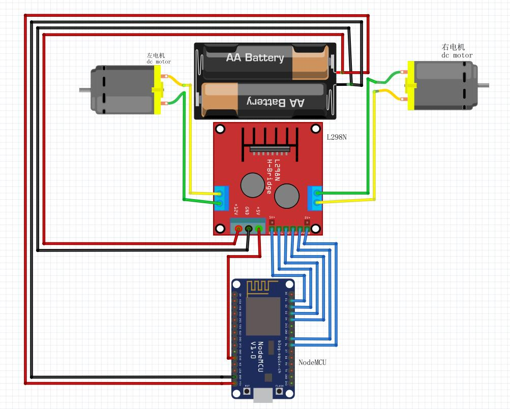

# 使用NodeMcu制作只能小车

## 硬件选择

- NodeMcu-ESP8266   :   WiFi控制
- L298N             ：  左右电机驱动
- 减速电机两个
- 18650电池

## Tips

1. 用了两个电池，用18650给点击供电，发现ESP8266电压太高，所以加了一个充电宝给板子供电
2. 第二个问题是ESP8266的输出是3.3V的，导致PWM输出供电不足，抛弃了电机调速功能，只实现前后左右的功能

## 硬件接线图

## 思路原理

- 使用Esp8266作为UDP服务器，接受客户端上传的数据，单个控制电机旋转
    1. Esp8266创建热点，设置工作模式为AP模式
    2. Esp8266创建UDP服务器，监听端口8888
- 数据使用五位长度十六进制，基本格式：***0xFF,0x00,0x00,0x00,0xFF***
    1. 第**0**位：0xFF        ：      起始位，值不变
    2. 第**4**位：0xFF        ：      结束位，值不变
    3. 第**1**位：
        - 0x00      :   左电机控制
        - 0x01      :   右电机控制
    4. 第**2**位：
        - 0x00      :   电机停止
        - 0x01      :   电机正转
        - 0x02      :   电机反转
    5. 第**3**位         :   电机转速控制

## 完成图

## LICENSE

    MIT License

    Copyright (c) 2019 Ice Lee

    Permission is hereby granted, free of charge, to any person obtaining a copy
    of this software and associated documentation files (the "Software"), to deal
    in the Software without restriction, including without limitation the rights
    to use, copy, modify, merge, publish, distribute, sublicense, and/or sell
    copies of the Software, and to permit persons to whom the Software is
    furnished to do so, subject to the following conditions:

    The above copyright notice and this permission notice shall be included in all
    copies or substantial portions of the Software.

    THE SOFTWARE IS PROVIDED "AS IS", WITHOUT WARRANTY OF ANY KIND, EXPRESS OR
    IMPLIED, INCLUDING BUT NOT LIMITED TO THE WARRANTIES OF MERCHANTABILITY,
    FITNESS FOR A PARTICULAR PURPOSE AND NONINFRINGEMENT. IN NO EVENT SHALL THE
    AUTHORS OR COPYRIGHT HOLDERS BE LIABLE FOR ANY CLAIM, DAMAGES OR OTHER
    LIABILITY, WHETHER IN AN ACTION OF CONTRACT, TORT OR OTHERWISE, ARISING FROM,
    OUT OF OR IN CONNECTION WITH THE SOFTWARE OR THE USE OR OTHER DEALINGS IN THE
    SOFTWARE.
